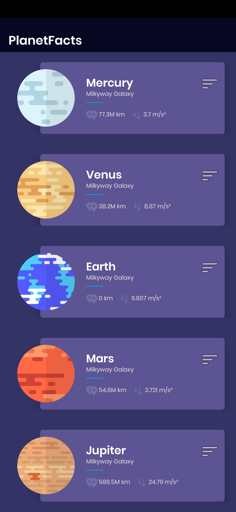
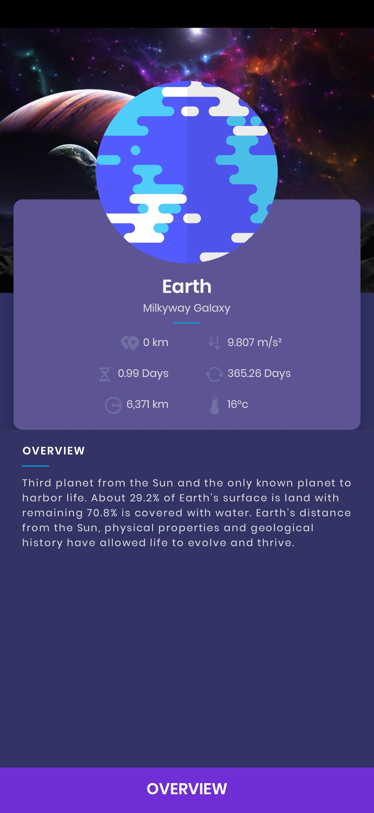
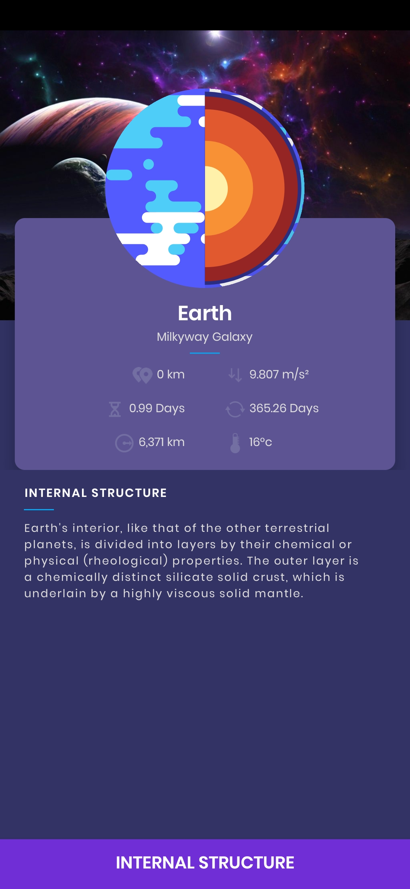
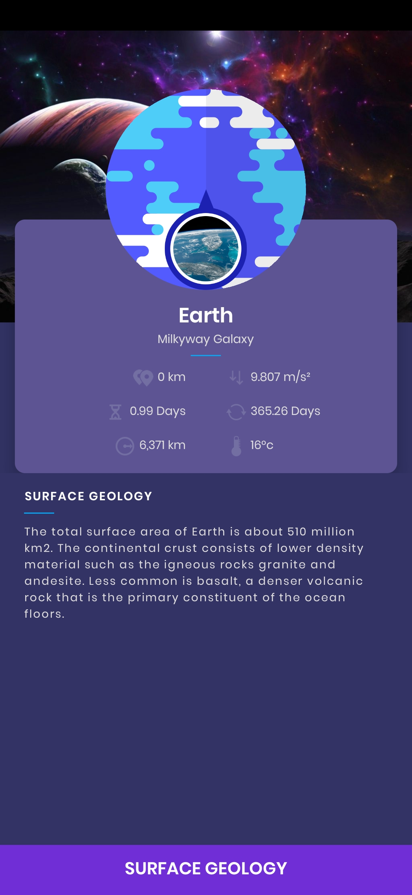

## PlanetFacts

PlanetFacts is an offline simple, modern & material-designed educational Android application for kids. It contains basic facts with visual illustrations about the planets in our solar system.<br/>

<div style="display:flex;" >
<br/>
<a href="https://github.com/sdnitrogen/PlanetFacts/raw/main/PlanetFacts.apk">
    
</a>
</div>

</br></br></br></br>

## Screenshots
<div style="display:flex;" >




</div>

### Features
- Fluid UI with Material design
- High quality and intuitive illustrations

## Tech
<br>
<br>

### Support Development

[](https://www.paypal.me/sdnitrogen)

## License
[](https://opensource.org/licenses/Apache-2.0)<br>
```
Copyright [2022] [Red Nitrogen]

   Licensed under the Apache License, Version 2.0 (the "License");
   you may not use this file except in compliance with the License.
   You may obtain a copy of the License at

     http://www.apache.org/licenses/LICENSE-2.0

   Unless required by applicable law or agreed to in writing, software
   distributed under the License is distributed on an "AS IS" BASIS,
   WITHOUT WARRANTIES OR CONDITIONS OF ANY KIND, either express or implied.
   See the License for the specific language governing permissions and
   limitations under the License.
```
